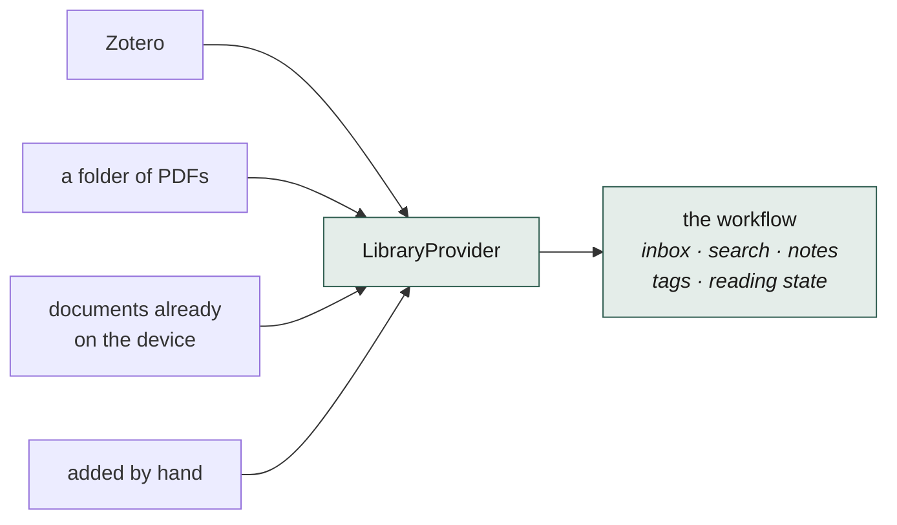
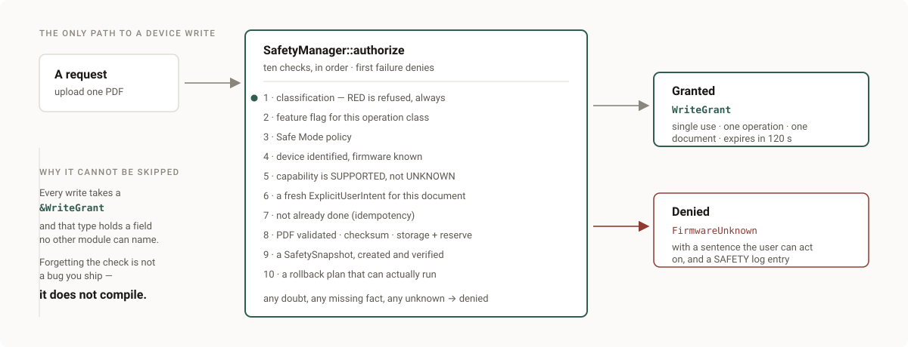
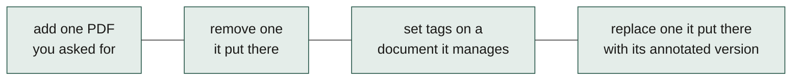
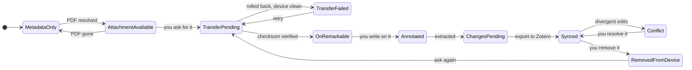
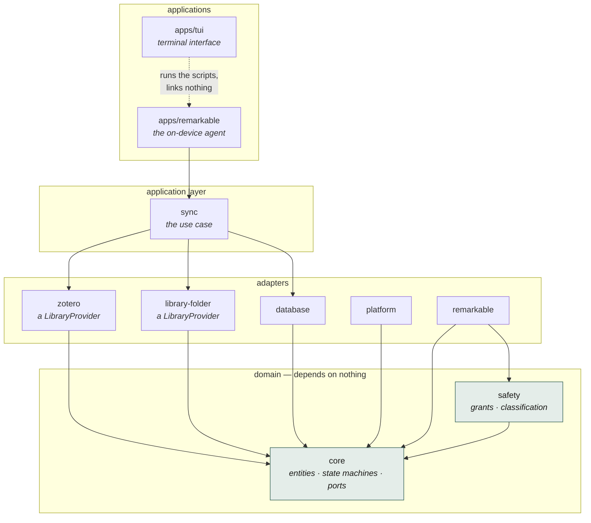

<div align="center">


<br>

**A reading and annotation workflow that runs _on_ your reMarkable 2.**

Know what you are reading. Find what you highlighted. Keep your reMarkable
exactly as it is.

[Why](#why) · [How it works](#how-it-works) · [Install](docs/INSTALL.md) ·
[Architecture](docs/architecture/ARCHITECTURE.md) ·
[Safety model](docs/safety/SAFETY_MODEL.md) · [Roadmap](ROADMAP.md)

<sub>MIT licensed · not affiliated with reMarkable AS</sub>

</div>

---

> ### Status — it works on real hardware, and here is exactly how far
>
> **Verified on a reMarkable 2 running firmware 3.28.0.166**, with 3,814
> documents on it:
>
> - installs into one directory, verified by checksum, and removes itself
>   completely — documents, reading positions and `xochitl` untouched
> - **reads 2,624 highlights across 26 documents**, with page numbers, and
>   exports them as Markdown
> - 13 MB of memory, 0.11 s, no process left running
> - on unvalidated firmware it permits **no writes at all**, which was observed
>   rather than assumed
>
> **Not done yet:** generated review documents, the stylus request form, and
> explicit document transfer. See the [roadmap](ROADMAP.md).
>
> Everything above is recorded, with what broke and what it cost, in
> [HARDWARE_VALIDATION.md](docs/remarkable/HARDWARE_VALIDATION.md).

## Why

The reMarkable is superb at reading and writing. It is not good at *the rest of
reading* — and that is what Marginalia is for.

Four things go wrong once you have more than a few documents on it:

| | |
|---|---|
| **Documents have no identity** | `attention.pdf` — no author, no year, no venue, no idea which of your projects it belongs to. |
| **Highlights go nowhere** | You mark a passage that matters. Three months later you cannot remember which of forty documents it was in. |
| **Nothing is searchable** | Your handwriting and your reading live on the device and stop there. |
| **Getting things on and off is manual** | Either you do it by hand every time, or a tool fills 8 GB with things you never meant to read there. |

Marginalia adds the missing layer — **library, reading, annotation,
knowledge** — and touches nothing else. It has one hard rule: your reMarkable
stays exactly as the manufacturer shipped it.

### Where your reading comes from

Zotero is the first source implemented, and a good one. It is **not** the
product.



Everything above the port works in terms of a source-neutral `LibraryItem`.
Nothing in the workflow knows what Zotero is — which is why a **folder of PDFs**
works today with no account, no key and no network, and why other sources can be
added without touching a line of the workflow.

## How it works



Three ideas, and the whole design follows from them.

### 1 · Knowing about a document is not the same as having it

> **Refreshing a source** brings titles, authors, collections, tags, and *which*
> documents exist. **A deliberate request** brings one specific document.

Refreshing will never copy a document onto your device. Not one, not five
hundred. You can browse your whole library — every title, author, collection and
tag — with **zero bytes** on the reMarkable.

This is not a promise in a README. `LibraryProvider` has no method that returns
file bytes, and `MetadataOperation` has no variant that can express a transfer.
The sentence cannot be written.

### 2 · There is no interface on the device, on purpose

Every known way to draw a custom UI on a reMarkable 2 requires injecting a
library into a system process — [we checked, with
sources](docs/remarkable/ECOSYSTEM.md). Marginalia will not do that.

So it does something better suited to the hardware: **everything it shows you is
a document in your library**, rendered by the reader you already use. To ask for
a paper, you tick a box with your stylus.



The consequence is the point: Marginalia only ever needs permission to **read**
your annotations, which is why it can leave the rest of your device completely
alone.

### 3 · Safety is a compile error, not a code review



Every function that changes something on a device takes a `&WriteGrant`. That
type holds a field no other module can name, so **there is no way to write to a
device without going through the authorisation path** — not because we
remembered to check, but because the alternative does not compile.

```rust
// read — no grant needed
fn list_documents(&self) -> DeviceResult<Vec<RemoteDocument>>;

// write — the grant is a parameter, not a check inside the body
fn upload_document(&mut self, grant: &WriteGrant, pdf: &ValidatedPdf, name: &str)
    -> DeviceResult<RemarkableDocumentId>;
```

## What is in scope, and what never will be

A tool that promises not to touch your device has to say what it therefore
cannot do. This is that list.

### Kept

| | |
|---|---|
| **The on-device agent** | One binary, one directory, no daemon. 13 MB, exits when done. |
| **Highlight extraction** | Reads what the device already stored. Works today: 2,624 highlights on the machine it was built against. |
| **Persistence with history** | Versioned extraction, so a format correction can be re-run rather than silently disagreeing with old rows. |
| **Markdown and JSON export** | Your reading, in files you own, readable without Marginalia. |
| **Generated review documents** | Digests written *into your library*, opened by the native reader. The only screen Marginalia will ever have. |
| **Explicit document transfer** | One document, because you asked for that document. |
| **Library sources as plug-ins** | A folder needs no network. Zotero is one source, not the point. |
| **The safety model** | Capability matrix, fail-closed permissions, install manifest, one-command removal that verifies itself. |
| **The request form** | A tick box on a generated index, read back from the annotation layer. |
| **The terminal interface** | `apps/tui` — install, check, configure and remove without memorising commands. |

### Excluded, permanently

| Not this | Why |
|---|---|
| **Any Marginalia interface on the device** — split view, sidebar, overlays, a command palette | There is no way to draw on a reMarkable 2 screen without modifying software that belongs to reMarkable. Not a limitation we plan to overcome. |
| **Patching `xochitl`** | It is invariant 1. It is also how [`ddvk/remarkable-hacks`](https://github.com/ddvk/remarkable-hacks) genuinely does add menu items — so this is a refusal, not an impossibility. See below. |
| **Writing tags into the device's own metadata** | A read-only bridge is an acceptable final answer. |
| **Annotating original PDFs on the device** | A PDF stack on armv7 to reproduce text that is already text. Export Markdown instead. |
| **OCR or handwriting recognition** | Out of scope; the device already does handwriting search. |
| **A package manager, or a system service** | Invariant. Marginalia does not survive a reboot by installing itself into one. |
| **Cloud sync of Marginalia's data** | Local-first. Your reading does not need a server. |
| **Automatic file transfer** | Sync moves metadata. Moving a document is always a separate, explicit request. |
| **A Tauri desktop application** | Removed 2026-08-13: six screens of mock interface wired to nothing, which had never once built. The terminal interface replaces it. |

### About the interface question, honestly

`ddvk/remarkable-hacks` really does add elements to the native interface, and it
is worth understanding how, because the answer decides this project's shape: it
**edits the bytes of the `xochitl` binary** in `/usr/bin`, per exact firmware
build, keeping a backup to undo it.

So drawing on the screen is possible. It is refused here, for a reason that
would hold even if it were effortless: the promise that Marginalia leaves your
device's own software alone is the reason it is safe to install. A version that
patched `xochitl` would be a different program making a different promise.

Two practical notes, separate from the principle. That project's patches stop at
firmware **2.15.1.1189** and its last commit was **June 2023**; a device on 3.x
has nothing to apply. And its own README states that using it violates the
reMarkable EULA and may cost you data. If you want it, install it deliberately
and knowingly — it is an honest bargain, openly described. It is simply not this
one.

The full reasoning, including the options that were considered and rejected, is
in [ADR-002](docs/adr/ADR-002-remarkable-ui-and-runtime.md).

## What Marginalia may do to your device

Four operations. That is the entire list.



All user-initiated, one document at a time, reversible, verified by checksum
afterwards, with a tested rollback. Everything installed lives in **one
directory** — removing Marginalia is removing that directory, which
[`reset.sh`](tools/device/reset.sh) does and then *verifies*.

Never, under any flag, setting or debug mode:

```
✗ patch or replace xochitl      ✗ modify the kernel, bootloader or updater
✗ write to a system partition   ✗ install a package manager
✗ create a startup entry        ✗ touch a document it did not put there
✗ modify an original PDF        ✗ delete anything to free space
```

### Untested firmware means read-only

No feature code parses a firmware string; it asks a capability layer backed by a
versioned matrix. Anything unverified on real hardware resolves to `UNKNOWN`,
and `UNKNOWN` never permits a write. A matrix entry claiming `SUPPORTED` with no
test date is loaded as `UNKNOWN` regardless — optimism in a data file cannot
grant permissions. A user override can *restrict* a capability, never expand
one; there is no "enable writes anyway" switch.

If your device updates overnight, Marginalia drops to read-only and says why.

## The document lifecycle

Every paper has exactly one state, and exactly one edge in the whole machine
puts a file on your device.



The edges that begin *"you"* are ones no timer, scheduler or sync job can ever
take. A test enumerates all 120 state-event pairs and fails if a second route to
a transfer ever appears.

## Install

Full guide: **[docs/INSTALL.md](docs/INSTALL.md)** ·
On the device: **[docs/INSTALL_REMARKABLE.md](docs/INSTALL_REMARKABLE.md)**

```bash
git clone https://github.com/cyuss/marginalia.git && cd marginalia
make setup            # or: just setup — identical names in both
```

Everything runs through `make` or `just`:

Then, for everything else, the terminal interface:

```bash
make tui              # install, check, configure, remove — without memorising commands
```

It runs the same scripts documented below, and hands the terminal over whenever
something needs an answer from you, so you type your own confirmations.

```bash
make check                  # everything CI runs
make build-device-docker    # build the agent for the reMarkable (needs only Docker)
make verify-device-binary   # run that ARM binary under emulation
make device                 # what you can do to a connected device
```

You need **Rust 1.90+** and **Docker** for device builds. There is no Node, no
JavaScript and no bundler. You do **not** need a reMarkable or a Zotero account
to develop — there is a simulator and synthetic fixtures.

### Adding a source

**A folder** — no account, no network, nothing to configure:

```bash
marginalia source add folder /home/root/papers
```

Filenames are read the way reference managers write them
(`Vaswani et al. - 2017 - Attention Is All You Need.pdf`), and subdirectories
become collections. When a filename says nothing, Marginalia claims only a
title rather than inventing authorship.

**Zotero** — an API key and nothing else; the library ID is discovered from the
key:

```bash
marginalia zotero connect <your-key>
marginalia sync
```

A key is **verified before it is stored, never after**. A key Zotero rejects
never reaches your disk, so setup cannot appear to succeed while nothing works.

## Architecture



Dependencies point inward, and **CI fails on a forbidden edge** — the rule is a
test that reads the actual manifests, not a diagram that drifts.

`core` is pure: no filesystem, no network, no database. That purity is what lets
the safety rules be tested exhaustively without hardware.

| | |
|---|---|
| **Sources** | Zotero · a folder of documents · more behind the same port |
| **Language** | Rust, everywhere. No JavaScript. |
| **Storage** | SQLite — rollback journal and `synchronous=FULL` on the device, WAL on a workstation |
| **Device target** | `armv7-unknown-linux-gnueabihf`, built in a container |
| **Terminal interface** | ratatui — runs on your computer, drives the agent over SSH |

## Privacy

No account. No Marginalia server. No telemetry. No analytics. Nothing uploaded.

The only outbound traffic is to the Zotero API, and only if you configure it.
Your key lives in a `0600` file in Marginalia's own directory, wrapped in a type
that renders as `<redacted>` in **every** format including debug output — so a
careless log line cannot leak it.

## Contributing

Read [CONTRIBUTING.md](CONTRIBUTING.md) and
[SAFETY_MODEL.md](docs/safety/SAFETY_MODEL.md) first. The short version:

- Never patch `xochitl` or touch system partitions. No flag enables this.
- Metadata sync must never transfer a file.
- Original PDFs are read-only, always.
- Unknown firmware means read-only. Fail closed.
- **If you do not know how a reMarkable behaves, do not guess.** Mark the
  capability `UNKNOWN`, write it down in
  [OPEN_QUESTIONS.md](docs/development/OPEN_QUESTIONS.md), and stop.

Good first contributions: simulator fixtures, PDF test fixtures, documentation,
and — most valuable of all — **firmware validation reports from real devices**,
which is what moves a capability off `UNKNOWN`.

```bash
make check    # must pass; a failing safety test never merges
```

## FAQ

<details>
<summary><b>Will this brick my reMarkable?</b></summary>

It cannot. Marginalia never writes to a system partition, never patches
`xochitl`, and never touches the bootloader, kernel or update mechanism.
Everything it installs is in one directory, and `reset.sh` removes it and then
verifies the device is back to stock.
</details>

<details>
<summary><b>Do I need Toltec, or a launcher?</b></summary>

No, and never automatically. Marginalia has no interface on the device, so it
needs neither. It does need the developer access reMarkable itself provides, to
be installed over SSH — which you enable and can turn off again.
</details>

<details>
<summary><b>Will it fill up my device?</b></summary>

It cannot. Nothing transfers without a deliberate request for a specific paper.
A configurable storage reserve is never spendable, and Marginalia refuses **its
own** writes before it would eat into it. It never deletes anything to make
room — it shows you what is large and lets you decide.
</details>

<details>
<summary><b>Why is so much unfinished?</b></summary>

Because the alternative was shipping device code before the safety layer that
constrains it. Everything dangerous is now impossible to express by accident,
and every remaining unknown is written down rather than guessed at.
</details>

<details>
<summary><b>Do I need Zotero?</b></summary>

No. A folder of documents works with no account, no key and no network — the
workflow sits above a `LibraryProvider` port and does not know which kind of
source it is reading. Zotero is the richest source implemented, not a
requirement.
</details>

<details>
<summary><b>reMarkable 1? Paper Pro?</b></summary>

V1 targets the reMarkable 2. The device model and capability layer are designed
so other models can be added without redesign, but they are not supported.
</details>

## Disclaimer

```
Marginalia is an independent community project.

It is not affiliated with, endorsed by, or sponsored by reMarkable AS.
reMarkable is a trademark of reMarkable AS.
```

No official reMarkable logos, branding or assets are used. Zotero is a trademark
of the Corporation for Digital Scholarship.

## Licence

MIT — see [LICENSE](LICENSE). The dependency stack was chosen to keep it that
way: PDFium is BSD-3 and `lopdf` is MIT, which is part of why the PDF layer is
Rust rather than a PyMuPDF sidecar (AGPL-3.0 or commercial). See
[ADR-001](docs/architecture/ADR-001-backend-stack.md).
